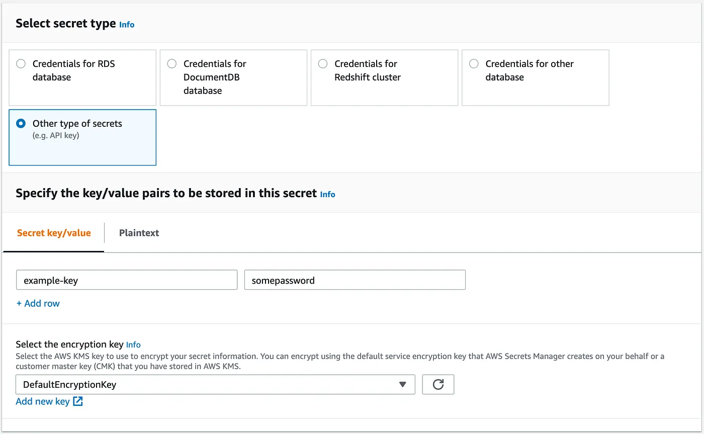
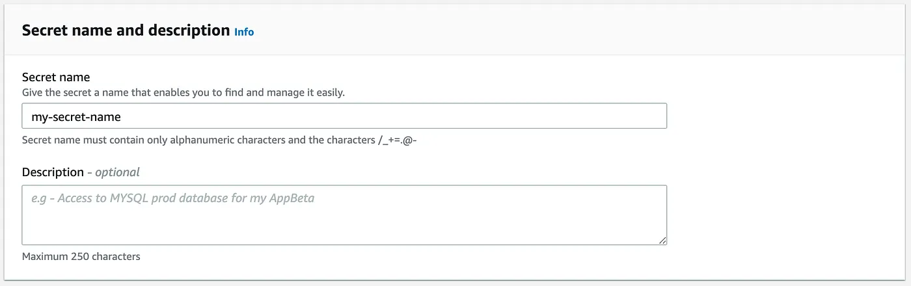

https://itnext.io/introducing-argocd-vault-plugin-v1-0-708433294b2d
https://itnext.io/argocd-secret-management-with-argocd-vault-plugin-539f104aff05

* goal
  * argocd-vault-plugin v1.0 
    * [release notes](https://github.com/argoproj-labs/argocd-vault-plugin/releases/tag/v1.0.0)
    * ALSO breaking changes

# New Inline Path Format

* | PREVIOUS argocd-vault-plugin v1.0-,
  * ⚠️requirements⚠️
    * set a `PATH_PREFIX` environment variable, OR
    * set an `avp_path` annotation
  * use cases
    * have MANY keys | secret
  * ❌NOT use cases❌
    * have 1 key / secret
    * you want to combine >1 secrets | 1 file
    * Reason:🧠requirements🧠

* | argocd-vault-plugin v1.0,
  * ⭐️you can NOW set individual paths | placeholders⭐️
    * 💡`<path:your/vault/path#keyname>`💡
    * allows
      * you can -- , via 1 Kubernetes Secret file, -- pull >1 Vault secrets
        * ❌NO need
          * annotation
          * EXTRA environment variable❌

    ```
    apiVersion: v1
    kind: Secret
    metadata:  
      name: inline-secret
    stringData:  
      inlineSecret: <path:path/to/vault#somekey>
      otherInlineSecret: <path:path/to/another/vault#someOtherkey>
    type: Opaque
    ```

# Support for AWS Secrets Manager

* original goal
  * support MORE tools (!=HashiCorp Vault)

* ⚠️requirements⚠️
  * argocd-vault-plugin v1.0

* steps
  * | "argocd-repo-server" pod,
    * set the environment variables

        ```
        AVP_TYPE: awssecretsmanager
        AVP_AWS_ACCESS_KEY_ID: Your AWS Access Key ID
        AVP_AWS_SECRET_ACCESS_KEY: Your AWS Secret Access Key
        ```

      * == ANY OTHER backed 
  * | AWS Secrets Manager, 
    * create a NEW Key/Value Secret

      
      
  * | k8s secret,

    ```
    apiVersion: v1
    kind: Secret
    metadata:
    name: example-secret
    stringData:
    # specify the propery secret name
    sample-secret: <path:my-secret-name#example-key>
    type: Opaque
    ```

# Support for all HashiCorp Vault Env Vars

TODO: 
An issue we saw come up early was that users expected to be able to use the default environment variables that a HashiCorp Vault backend accepts
* Up until now, we were wrapping certain variable
* But as of v1.0, all HashiCorp Vault environment variables are accepted if using a vault backend!

# Migrating from 0.x to 1.0
With the major release there are some breaking changes that will need to be addressed when upgrading to v1.0.

Changing Annotations

With v1.0 we updated our annotations to fit the Kubernetes naming convention
* Those changes are:

avp_path -> avp.kubernetes.io/path
avp_ignore -> avp.kubernetes.io/ignore
kv_version -> avp.kubernetes.io/kv-version
AVP Prefix for Environment Variables

The prefix AVP is now required for all AVP related environment variables
* This does not include Vault environment variables
* In version 0.x, you could use a config file or Kubernetes secret without using the AVP prefix
* With v1.0, you must use AVP even if using a config file or secret.

Deprecating PATH_PREFIX

As of v1.0 we are removing support for the PATH_PREFIX environment variable
* You will want to move to using inline paths or the avp.kubernetes.io/path when upgrading.

IBM Secret Manager name change

Since we added AWS Secrets Manager, we wanted to update the naming in the environment variables to be more consistent
* For v1.0, secretmanager should now be referenced as ibmsecretsmanager.
